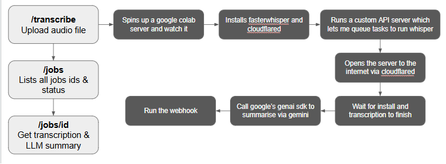
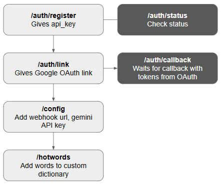

# TranscriptionAPI

https://transcriptionapi.shashwat.hackclub.app/docs

In short this project uses your Google Colab/Kaggle free gpu's And runs the heavy speech-to-text models on it and uses Google's free AI studio key to summarise it too. (optional)

The flow is simple:
1. User comes and first gets his API key.
2. Then goes ahead and verifies with Google Colab, basically goes to the Google OAuth so they can get access to the free GPU.
3. After that they basically go ahead and configure their optional webhook URL and optional Google Studio API key so they can get a webhook notification once the transcription is finished and/or generate an LLM summary 
4. Next, you can configure hotwords. Hotwords are basically your custom dictionary that you would want the whisper model to get right, the correct spelling eg: Shashwat etc
5. Now comes the most important thing. You simply queue in an audio file and wait for the webhook.
6. Additionally you can query and get the status and current transcription.

This project is a FastAPI-based Speech Transcription API designed to dynamically leverage Google Colab’s T4 GPU runtimes for high-performance audio transcription using Whisper.

# Key Characteristics & Workflow
1. Dynamic Runtime Orchestration: The API allocates and manages Google Colab T4 GPU instances dynamically per user (linked via gColab).
2. Cloudflare Tunneling: Once a Colab instance is created, the project deploys a lightweight faster-whisper server on the instance and exposes it to the API server via a Cloudflare tunnel
3. Queue & Job Management: Transcription jobs are submitted, queued in a FIFO order, and stored in an SQLite database using SQLModel.
4. Post-Transcription Summarization: It leverages Gemini models (via google-genai) to generate automated summaries and execute custom prompts/tasks on the transcribed text.
5. Additional Features: The project includes rate limiting (SlowAPI), customizable webhook alerts for job completion, and a Python client SDK.


# Meeting Submission Requirements

1. My API is publicly accessible on the internet with a URL ✅
2. My API has 7 GET endpoints and 4 POST endpoints and 1 DELETE endpoint ✅
3. My API includes docs at /docs and /redoc. Built with Swagger & Redoc ✅
4. My API is usable by anyone. It takes under 30 sec to make and authenticate an account, however a DEMO key can be provided on request by the reviewer (sorry i cannot include it in doc as it uses colab free credits) ✅
5. My code is in a public git repo with a hand-written README explaining what it is ✅
6. Defo had a lot of fun making this super cool project 😝


# Flow

### Important




Well when we are transcribing a file:
1. We spin up the Google Colab server and we have to ensure that there's only one instance running and that instance is live.
2. We have to install all the dependencies.
3. We have to add our custom server code to it and make sure it's running.
4. We have to add cloudflared and we will have to bind the port so it's publicly available.
5. We will have to get the URL from the server so we can access it.
6. Basically we have made a whisper server that runs on Google Colab so we can access whisper models, using the whisper client. That way we can interact with it, we can queue tasks whenever we want, etc
7. Once our server is warmed up then we can actually upload the audio file to it and get the transcript. 
8. Once we have the transcript, we have to take the transcript and give it to the LLM, and the LLM is going to create a summary of your transcript. 
9. After that we execute a web hook push to notify you

**The project really sounds simple but is genuinely really complicated when you get into the technical details.** 

# Endpoints

The project has multiple endpoints:

## 1. Authentication Section (`/auth`)

*   **`POST /auth/register`**
    *   **Description:** Registers a new user and generates the initial API key required for authentication.
*   **`GET /auth/link`**
    *   **Description:** Generates a Google OAuth authorization URL. Users have to run powershell script (read below) to authenticate with their Google account and grant access to the free Google Colab server.
*   **`GET /auth/colab`** *(Internal)*
    *   **Description:** The callback endpoint where Google OAuth redirects after successful user authentication, supplying the backend server with the necessary access tokens.
*   **`GET /auth/status`**
    *   **Description:** Returns the operational status of the service, verifying if the API token is valid and checking the availability of free credits.

---

**Read this:**
Ideally we would just be okay with the URL if you are working on localhost but we are not. This is Google's reverse engineered unofficial API, which is logged to localhost, and there is nothing we can do about it. It wouldn't work with our server. The only way to make it work is that we redirect it to localhost and the partial script is basically a web server that catches it and blindly redirects it to our server. It's a temporary proxy while we are doing the authentication but the proxy kills itself once it's done

**windows:** run this script, then manually navigate to the url, it will automatically redirect you.
```powershell
$l = [System.Net.HttpListener]::new(); $l.Prefixes.Add("http://localhost:8007/"); $l.Start(); Write-Host "Listening on 8007..."; while($l.IsListening) { $c = $l.GetContext(); $req = $c.Request; $res = $c.Response; if($req.RawUrl -like "*favicon.ico*") { $res.StatusCode = 404; $res.Close(); continue }; $target = "https://transcriptionapi.shashwat.hackclub.app" + $req.RawUrl; Write-Host "Forwarding browser to: $target"; $res.StatusCode = 302; $res.RedirectLocation = $target; $res.Close(); break }; $l.Stop()
```

**linux/mac**:not tested
```bash
python3 -c 'import http.server, sys, threading; server = http.server.HTTPServer(("localhost", 8007), type("H", (http.server.BaseHTTPRequestHandler,), {"do_GET": lambda s: s.send_response(404) or s.end_headers() if "favicon.ico" in s.path else (print(f"Forwarding browser to: https://transcriptionapi.shashwat.hackclub.app{s.path}"), sys.stdout.flush(), s.send_response(302), s.send_header("Location", f"https://transcriptionapi.shashwat.hackclub.app{s.path}"), s.end_headers(), threading.Thread(target=server.shutdown).start())})); print("Listening on 8007..."); sys.stdout.flush(); server.serve_forever()'
```


## 2. Configuration Section (`/config`)

*   **`GET /config/get`**
    *   **Description:** Gives the current global configuration settings.
*   **`POST /config/post`**
    *   **Description:** Updates global configuration parameters, specifically the global webhook URL and the Gemini API key.

---

## 3. Hotwords Section (`/hotwords`)

*   **`GET /hotwords`**
    *   **Description:** Retrieves the current list of defined hotwords.
*   **`POST /hotwords`**
    *   **Description:** Adds a new word to the hotwords list.
*   **`DELETE /hotwords/{word}`**
    *   **Description:** Deletes a specific hotword from the list.

---

## 4. Transcription Section (`/transcribe`)

*   **`POST /transcribe`**
    *   **Description:** The primary application endpoint used to upload an audio file for processing.
    *   **Optional Parameters:**
        *   `webhook_override`: Temporarily overrides the global webhook URL for this specific request.
        *   `gemini_prompt`: Passes a custom prompt to configure and guide the LLM summary generation.

---

## 5. Jobs Section (`/jobs`)

*   **`GET /jobs`**
    *   **Description:** Lists all processing jobs, providing their individual statuses and any error details if applicable.
*   **`GET /jobs/{id}`**
    *   **Description:** Fetches the comprehensive details of a specific job by its ID, including the complete transcript, the generated LLM summary, and the execution status.
    
# Flat bonuses

| Buff / Feature                                           | Bonus Multiplier |  |
|:---------------------------------------------------------| :---: | :---: |
| **Authorization** (X-API-Key)                            | +0.15 | ✅ |
| **Persistence** (SQLite database, temp file storage)     | +0.10 | ✅ |
| **External API integration** (non-trivial, Google Colab) | +0.10 | ✅ |
| **Rate limiting** (IP-based)                             | +0.10 | ✅ |
| **Pagination** (for the job lists)                       | +0.05 | ✅ |
| **Error handling & input validation** (with Pydantic)    | +0.05 | ✅ |
| **6 Additional endpoints**                               | +0.12 | ✅ |

Final bonus = **+0.5 (capped)**

# Architecture

The architecture is quite simple. We use the Pydantic and FastAPI ecosystem as much as we can for almost everything.  
- `models.py` is a SQL model where we define every single thing and we use Pydantic validators everywhere to validate everything. \
- `database.py` is just the initialization of SQLite, that's all.  
- `config.py` uses Pydantic settings where all the settings are stored. However that can be overridden with `.env`. 
- `main.py` is just the entry point which starts the app.  
- `manager.py`  basically interacts with Google Colab and Whisper and manages the entire orchestration of all runtimes etc.  
- `api.py` is the main file where all the FastAPI URLs and everything is defined related to FastAPI.

Under the `SDK` folders we have `whisper_sdk.py`, `colab_sdk.py` and `whisper_server.py`.
- `whisper_sdk.py` and `whisper_server.py` go hand in hand. 
Whisper server is code that will be running on Google Colab and Whisper SDK is a small script that helps us to easily interact with the API.
- `colab_sdk.py` as the name suggests, it interacts with Google Colab's reverse engineered APIs 

https://transcriptionapi.shashwat.hackclub.app/docs

# video demo


https://github.com/user-attachments/assets/d4020a65-5e6b-4146-a1f7-e9e5b9566980

# screenshots


